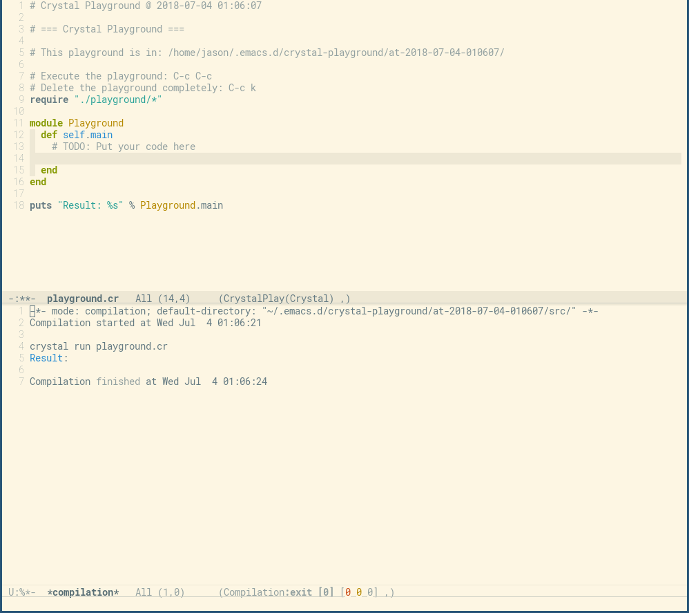

<!-- *- mode:markdown;mode:orgtbl;fill-column:99 -* -->
<!-- # rust-playground   -->

*It works. But development still in progress!*

GNU/Emacs mode that setup local playground for code snippets in the Crystal
language. Heavily inspired by
[rust-playground](https://github.com/grafov/rust-playground).

## Install

Install `crystal-playground` from MELPA:

    Coming soon!

The mirror repository of the project: **TODO**

Example screen after creation of a new snippet:

## Usage

### Quick start

1. From any mode run `M-x crystal-playground` for start a new playground buffer filled with basic template for the package with main function (see the picture below).
1. Add your code then press `Ctl-Return` (it bound to `crystal-playground-exec` command). It will save, compile and exec the snippet code.
1. When you played enough with this snippet just run `M-x crystal-playground-rm`. It will remove the current snippet with its directory and all files.

### List of interactive functions

| Function name                 | Description                                                          |
|-------------------------------|----------------------------------------------------------------------|
| `crystal-playground`          | Create a new playground buffer with basic template for the package.  |
| `crystal-playground-download` | [WIP] Download the snippet from the URL at play.crystal-lang.org.    |
| `crystal-playground-exec`     | Save, compile and run the code of the snippet.                       |
| `crystal-playground-upload`   | [WIP] Upload the buffer to play.golang.org and return the short URL. |
| `crystal-playground-rm`       | Remove the snippet with its directory with all files.                |
